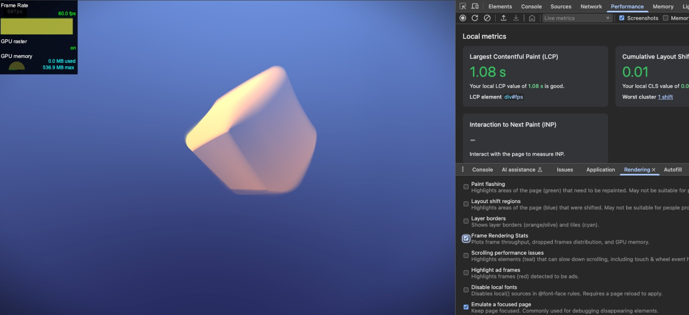

# webgpu-blob

This repository contains an experiment built with WebGPU and WGSL (WebGPU Shading Language).

## Browser Setup for WebGPU

### Supported Browsers

- **Chrome/Edge**: WebGPU is enabled by default in Chrome 113+ and Edge 113+
- **Firefox**: Supported in Firefox 119+
- **Safari**: Supported in Safari 17+

### Enabling WebGPU

- **Chrome/Edge**: No additional configuration needed in recent versions
 - For older versions or to force enable experimental features:
   1. Navigate to `chrome://flags` or `edge://flags`
   2. Search for "WebGPU"
   3. Set "Unsafe WebGPU" to "Enabled"
   4. Restart your browser
- **Firefox**: 
 1. Go to `about:config` in your browser
 2. Search for `dom.webgpu.enabled`
 3. Set it to `true`
- **Safari**: Make sure you're using Safari 17 or newer

### Hardware Compatibility Check

You can verify if your hardware and browser configuration supports WebGPU by running a simple script in your browser console that checks for the presence of the WebGPU API.

You can also check your browser and hardware compatibility at [WebGPU Report](https://webgpureport.org/), which provides detailed information about your system's WebGPU support.

## Troubleshooting

- **Black screen or rendering issues**: Update your graphics drivers to the latest version
- **Performance problems**: Check the browser console for warnings or errors
- **WebGPU not available**: Ensure your GPU supports WebGPU and that you're using a compatible browser version

## Development Resources

- [WebGPU Specification](https://www.w3.org/TR/webgpu/)
- [WGSL Specification](https://www.w3.org/TR/WGSL/)
- [WebGPU Samples](https://webgpu.github.io/webgpu-samples/)
- [WebGPU Best Practices](https://toji.github.io/webgpu-best-practices/)

## Live Demo

Check out the [demo](https://webgpu-blob.netlify.app/) to see the experiment in action.

## License

This work is licensed under a [Creative Commons Attribution-NonCommercial 4.0 International License (CC BY-NC 4.0)](https://creativecommons.org/licenses/by-nc/4.0/).

### What this means:

- **Attribution** — You must give appropriate credit to [Andrea Bovo](https://github.com/spleennooname), provide a link to the license, and indicate if changes were made.
- **NonCommercial** — You may not use this material for commercial purposes.

You are free to:
- Share — copy and redistribute the material in any medium or format
- Adapt — remix, transform, and build upon the material

Under these conditions:
- You must provide proper attribution to [Andrea Bovo](https://github.com/spleennooname) as the original creator
- You cannot use the material for commercial purposes
- No additional restrictions — You may not apply legal terms or technological measures that legally restrict others from doing anything the license permits

For the full license text, visit: [https://creativecommons.org/licenses/by-nc/4.0/legalcode](https://creativecommons.org/licenses/by-nc/4.0/legalcode)